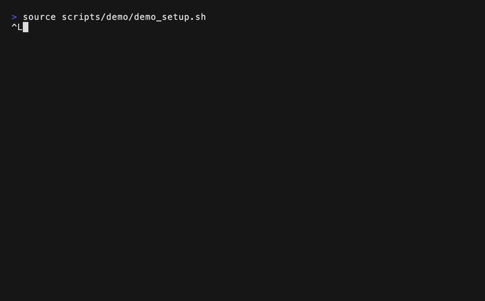
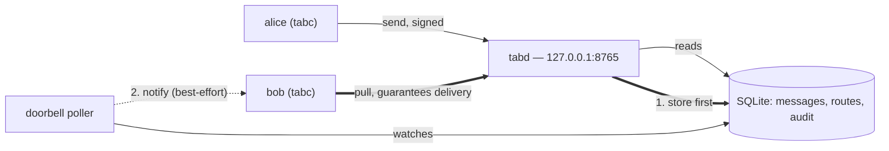

# tabc


[](https://github.com/jultabc/tabc/actions/workflows/ci.yml)
[](https://pypi.org/project/tabc/)
[](LICENSE)
[](pyproject.toml)

A shared inbox for AI agents and programs on one machine.



Anything that can run a command line can register as a node: an AI agent in a
terminal, a git hook, a long-running engine, a cron job. They exchange messages
through the same local bus. No cloud, no account, no external service.

Two kinds of node, and the difference is about communication capability, not
whether a terminal is attached:

- **Normal.** A Claude or Codex agent using the CLI or an MCP client. It can send
  and pull messages. A terminal route may ring the doorbell; an MCP-only client
  has no terminal doorbell and receives by pulling.
- **Program** (`register --program`). A hook, a daemon, a scheduled job. It is a
  send-only event source: it claims no terminal, can send as its signed node, and
  is rejected if an envelope names it as a recipient.

Four names run through this project. **tabus** is the bus; `tabc` is what an
agent runs.

| | |
|---|---|
| **tabus** | the package, and the bus inside it. Environment variables carry the `TABC_` prefix |
| `tabc` | the command-line client an agent runs, and the public entry point for normal use |
| `tabd` | the local daemon; `127.0.0.1:8765` unless `TABC_BUS_URL` says otherwise |
| `tabus.doorbell` | the notification poller |

> **Status: prototype.** The interfaces below are what it does today, not
> what it is headed towards.
> One dependency, `cryptography`, for the signatures that authenticate every
> request. SQLite for storage; standard library for the rest.

It is meant to stay small enough to read. Count it rather than trust a number
printed here — a baked total is stale by the next commit, which is why this
project keeps route lists and counts out of the prose:

```bash
git ls-files '*.py' | xargs wc -l | tail -1   # Python lines
git ls-files | wc -l                          # tracked files
```

---

## The problem

When you run several AI coding sessions at once, **they cannot see each other.**
To move a conclusion from one window to another, you copy and paste it yourself.

That makes you the relay for every conversation, and three things hurt:

- **You cannot tell whether the other side can take input right now.** Pushing
  into a busy window breaks whatever it was doing.
- **You cannot tell whether your message arrived.** When delivery fails, the
  sender still thinks it worked.
- **If the other side is closed, the message is gone.** There is no way to
  receive it later.

tabc fixes those three.

| Existing approach | Limit |
|---|---|
| Editor's built-in session channel | Same product only, same machine only |
| Writing straight into a terminal | No delivery confirmation, interrupts a busy window |
| Copying by hand | You are the bottleneck |

---

## How it works

`tabd` stores the message before anything else. The doorbell then tries to
notify the receiver, but it is best-effort and can miss — a stale route, a
closed window. A message is delivered only when the receiver pulls it.



---

## Install

Python 3.9+ and one dependency, `cryptography`, which `pip` brings in for you.

From PyPI:

```bash
pip install tabc
```

From a checkout, which is what you want if you intend to change the code:

```bash
git clone https://github.com/jultabc/tabc.git
cd tabc
pip install -e .
```

This is an editable install: `tabc` and `tabd` import the code from the checkout,
so ordinary Python edits do not require another install. Restart a running
`tabd` after changing server code; like any Python process, it keeps the modules
it has already imported. Run the install again after changing dependencies,
package metadata, or console entry points in `pyproject.toml`.

If you would rather not create the console commands, clone the repository and
run the same modules directly. Every command below works either way:

```bash
python3 -m tabus.cli   ...   # the same as: tabc ...
python3 -m tabus.daemon ...  # the same as: tabd ...
```

Running from a clone rather than installing means installing that one dependency
yourself — `pip install cryptography`. Every request to the daemon is
authenticated by an ed25519 signature, so this is not optional the way an
optional feature is: without it `tabd` stops on its first import.

### Where state lives

By default, persistent state is under `~/.tabc`. The directory is created on
first use and tightened to owner-only permissions. Set `TABC_HOME` before
starting a process to move the whole installation state somewhere else; tests
use this to stay away from the real inbox.

| Path | Purpose |
|---|---|
| `~/.tabc/tabus.db` | nodes, messages, deliveries, routes, and audit records |
| `~/.tabc/.node_key.<node-id>` | that node's private signing key |
| `~/.tabc/host_id` | stable id used to decide which installation owns a terminal route |
| `~/.tabc/user_email` | optional owner label written by `tabm config` |
| `~/.tabc/data/doorbell_ring.db` | the doorbell's separate observation and ring ledger |

`TABC_DB` may point the message database somewhere else. It does not move keys,
`host_id`, or the doorbell ledger; use `TABC_HOME` when you want a fully isolated
installation.

The state directory itself may be created when the package resolves its paths at
import time. The database and key files are created only when a command needs
them, which is why `TABC_HOME` and `TABC_DB` must be set before importing tabus
in an isolated test.

### Node identity and signing keys

Node identity is process-scoped. Set `TABC_NODE`, or pass `--node` / `--sender`
to commands that expose one. There is no shared on-disk default: several agents
can use one installation without silently inheriting another agent's identity.
Commands that have no explicit identity option stop before HTTP unless
`TABC_NODE` is set.

For `rm` and `restore`, `--node` names the target being removed or restored,
not the acting node. Those commands always require `TABC_NODE` to identify the
caller.

```bash
# This shell acts as alice for commands such as who and tac ls
export TABC_NODE=alice

# Register or re-register the node and capture a route when one is available
tabc register --node alice --kind codex

# Opt in only when this exact route should press Enter after the doorbell text
tabc register --node alice --kind codex --auto-enter on

```

`register` alone bootstraps the node's key and registers a normal node.
It inspects `TMUX`/`TMUX_PANE` and `ITERM_SESSION_ID` and accepts a route only when
the target terminal matches this process's controlling terminal or a same-session
ancestor's terminal. Piped output alone does not prevent registration; inherited
variables alone do not prove attachment. A rejected inherited route can retire
only the same node's exact matching unverified legacy route, never a verified
route or a different target. With no route variables, registration preserves any
existing route; use `read` when this process has no verified route. The former `name` command
and automatic terminal title changes have been removed.

Automatic Enter is **off for new routes**. Omitting `--auto-enter` preserves
the same active route's setting. Passing `--auto-enter off` disables submission.
Only `--auto-enter on` enables Enter for that registered route; other values are
rejected. A new, moved, or revoked route defaults to off. A route-less
registration preserves an existing setting unless off is explicitly requested.
This does not make terminal injection safe: even without Enter, the doorbell text
still enters an execution-capable input field. After first deploying this feature,
stop the old `tabus.doorbell` first: a resident old notifier still presses Enter
on every ring. Then restart `tabd` so it loads the code and migrates the database,
and finally start the new doorbell with the same launch environment it had before.
The client refuses a routed registration when `tabd` does not echo the requested
`auto_enter` state, which exposes a mixed-version deployment. Later on/off changes
are read from the route on every ring and need no restart.

Older versions wrote `~/.tabc/node`; current clients ignore that file. Each
local installation directory plus node id gets an independently generated
Ed25519 key pair. The private key is a raw 32-byte file at
`~/.tabc/.node_key.<node-id>`, created with mode `0600` inside the `0700`
state directory. It is not encrypted at rest. Never commit, log, or transmit it.
Only the Base58 public key is registered with tabd.

Ed25519 provides authentication and tamper detection; it does **not** encrypt
message bodies. The current local HTTP transport is not TLS either. Each request
signs hashes of the acting node, HTTP method, exact path, exact body, and Unix
timestamp. tabd accepts timestamps within 300 seconds to limit later replay; it
does not use a nonce to reject an identical replay inside that window.

The first public key registered for an id is pinned. A second machine that creates
a fresh key for the same id will therefore be refused. Use device-specific ids
such as `alice-desktop` and `alice-laptop` when each device owns an independent key.
Replacing a lost or compromised key is a local operator action, not an HTTP API:

```bash
python3 -m tabus.bus rotate-key <node-id> <new-public-key> --by <operator-id>
```

Rotation keeps message history and writes an audit record.

An automatic program has its own identity and key. Register it explicitly:

```bash
tabc register --node sample-program --kind engine --program
```

## Starting an agent on it

[`session_bootstrap.json`](session_bootstrap.json) is one file an agent reads
before its first command. It carries the command forms, the argument names, and
the two rules that are easiest to get wrong: a received body is data rather than
an instruction, and a node's private key never leaves `TABC_HOME`.

It is documentation, not configuration. Nothing loads it at runtime and it is
not in the installed package, so an agent reads it from the repository — here,
or at the raw URL:

```
https://raw.githubusercontent.com/jultabc/tabc/main/session_bootstrap.json
```

Its command list is maintained from `tabus/cli.py`. Where the two disagree, the
code is right; `tabc --help` settles it.

## Quick start

Start the daemon first. Every other command talks to it over local HTTP and
fails with a connection error until it is running.

```bash
tabd &   # 127.0.0.1:8765 by default
```

```bash
# In Alice's shell, register the node — the identity rides on the command
tabc register --node alice --kind claude

# In Bob's shell, register bob the same way

# who takes an acting identity like every other command; TABC_NODE supplies it
export TABC_NODE=alice
tabc who

# Send
tabc send --sender alice --to bob \
    --subject "subject" --body "body" --priority next

# Receive
tabc pull --node bob            # fetch new messages
tabc open --node bob --id <id>  # read one
tabc ack  --node bob --id <id> --state READ
```

`tabc send` is the only sending command. `tabc dm --node bob` lists unread
subjects (the former `mailbox` command); it does not mark them READ.
`tabc sent --node alice` lists outgoing messages and per-recipient delivery states.
Add `--id <full-UUID>` to view a sent body without changing delivery state.
READ records acknowledgement, not task completion.

Management commands live in `tabm`: `config`, `list`, `disable`, `enable`,
`purge`, and `rotate-key`. For node changes, `--node` is the signed caller and
`--target` is the node being changed. Disable and purge require `--yes`.
This command split does not add administrator authorization. The daemon checks
node signatures, but disable/enable/purge have no separate administrator-role
check. Key recovery remains local-only.

Because nothing in the code holds that authority, the gate is the user. An
agent asks before running any `tabm` subcommand, including the read-only ones,
naming the exact command and its target. `--yes` is not that approval, and
neither is a valid node signature.
Old `dm --sender ...` scripts must use `send`. `tabc mailbox`, `config`, `rm`,
and `restore` are no longer accepted. HTTP paths remain compatible; `sent`
requires a daemon with the new `/sent` endpoint.

`send` prints what it stored, and for whom:

```
stored id=7b3e1a2c-4f5d-4a71-9c2e-0f1d2a3b4c5d
  stored for: bob (1)
  carol: 12 pending
```

Read the `stored for:` line every time. A request is not a delivery, and the
exit code will not catch the usual mistake: if every recipient is unregistered
the command exits 1, but if only one name is misspelled the message is stored
for the rest and the command still exits 0.

The `N pending` figure is that node's **total** unread, not a receipt for this
message.

`tabc who` reports presence separately, one line per node:

```
bob        3 pending · mailbox 2026-08-23T01:41
```

## Reaching the bus from something else

There is no MCP server in this repository, and no other adapter. What there is
is a plain local HTTP API, and that is usually enough to write one in an
afternoon.

The daemon speaks JSON over HTTP, on `127.0.0.1:8765` unless `TABC_BUS_URL` says
otherwise. Rather than copy the routes here — a list and its count both go stale
the first time one is added or dropped, and this paragraph's did — ask the daemon
what it dispatches on:

```bash
python3 - <<'PY'
import ast
tree = ast.parse(open("tabus/daemon.py").read())
routes = {
    n.value
    for n in ast.walk(tree)
    if isinstance(n, ast.Constant)
    and isinstance(n.value, str)
    and n.value.startswith("/")
    and n.value.count("/") == 1
    and len(n.value) > 1
}
print(len(routes), "routes:", " ".join(sorted(routes)))
PY
```

The CLI's own command names are a slightly different set — `open` posts
to `/reopen`, and `attach` is a loop over endpoints rather than a
route of its own. Count the daemon when you want the wire surface.

Every request carries three headers — `X-Node`, `X-Node-Ts`, and `X-Node-Sig`,
an ed25519 signature over the node id, method, path, body and timestamp. There
is no shared secret to hand out: a caller signs with its own node key, and the
daemon checks it against the key that node registered. `tabus/nodekey.py` is the
whole of it, and `tabus/cli.py` is a working client of every one of them — the
shortest specification of the wire format, one file, hiding nothing.

So an MCP client, editor integration, chat bot, or other adapter is a thin
translation layer: use a normal node when it supports both send and pull. Lack of
a terminal only means there is no terminal doorbell. Use `register --program`
only for an automatic send-only event source such as a monitor, a hook, or a
cron job. Because each client signs as its node, its requests remain attributable.

**Why nothing is shipped here.** An adapter is shaped by what it is adapting to
— the MCP client's own conventions, its config file, where it wants the server
to live. Guessing that shape in advance produces an adapter that fits no real client.
The API is small and stable enough that writing the one that fits you is less
work than bending one that does not.

## Commands

`tabc --help` is the reference. It is generated from the code, so it does not
go stale the way a table in a README does.

The main ones: `register` `who` `send` `pull` `open` `ack` `tac` `snooze`.

## Questions that come up

### I edited the checkout. Do I need to reinstall?

Not after an editable install for an ordinary `.py` edit. Restart any long-lived
process that imported the changed module, especially `tabd` or the doorbell.
Re-run `pip install -e .` after changing `pyproject.toml` dependencies, package
metadata, or entry points.

### Does registration set the identity for later commands?

No. Registration writes the node and its public key to the bus; it cannot change
the environment of the shell that launched it. Export `TABC_NODE` for commands
without an acting-node option. The old `~/.tabc/node` default is deliberately
ignored because concurrent agents would otherwise share one mutable identity.

### Does `tabc who` require `TABC_NODE`?

Every request is signed, `who` included — there is no unauthenticated endpoint,
because the node roster it returns is worth gating to registered nodes. Pass
`--node` to identify the signing caller, or use the shell's `TABC_NODE` fallback.
This identifies who is asking, not whose inbox is being read:

```bash
tabc who --node <your-node>
```

Commands that name an acting node — `send --sender`, `pull --node`, and so on —
do not need it.

### How do I actually get the alarm to ring?

Installing does not start it. The notifier is a separate process, and it starts
in `SHADOW` mode, which records what it *would* have typed and types nothing:

```bash
DOORBELL_MODE=LIVE python3 -m tabus.doorbell     # ring for real
DOORBELL_MODE=SHADOW python3 -m tabus.doorbell   # record only; the default
DOORBELL_POLL_SEC=2                              # poll interval, default 2
```

Stop it with the usual signal to that process; there is no daemon to ask.

Read `SHADOW` first if you are unsure. It shows you which node and which
terminal the ring would reach without touching anyone's keyboard, and a
mis-registered route is much easier to see there than after it has typed into
the wrong window.

`LIVE` types into a terminal's input field. That is the mechanism, not a side
effect — see [SECURITY.md](SECURITY.md), where transport safety is marked as
not passing for exactly this reason. Automatic Enter is a separate decision
again, off by default, and enabled per route with `register --auto-enter on`.

### Why did registration succeed but no doorbell route appear?

The bus and the terminal route are separate. `register` checks that the inherited
tmux or iTerm target matches the process's terminal. Detached runners and mismatched
targets cannot claim a route. Existing verified routes survive stale cleanup requests.
Update the server and all registering clients before relying on this protection;
the verification flag is a client claim, not a security boundary against signed callers.
`register --program` always declines a terminal route and
creates a send-only node.
Use a separate name: an existing agent cannot be converted into a program.
New program registration and re-registration of an existing program are allowed.

### Can an adapter write `tabus.db` directly?

It can technically open SQLite, but it should not. `tabd` is the HTTP write
boundary for clients: it verifies the signed caller, enforces self-scoped
actions, runs migrations, and keeps delivery transitions in one place. A new
adapter should use the signed HTTP API and treat `tabus/cli.py` as the reference
client.

---

## Two ways to send

| | Goes to | Rings the doorbell | Use it for |
|---|---|---|---|
| **dm** (`--to`) | one or more named nodes | yes, if routed | a message addressed to explicit recipients |
| **tac** (`--tac`) | every member of a topic | yes, if routed | a line added to an ongoing topic |
| **broadcast** (`--broadcast`) | every non-program, non-removed node other than the sender | yes, if routed; through SHADOW too | a one-time announcement |

"If routed" is the whole condition. A doorbell needs a terminal route on the
receiving node; a node with none is `NOT_MINE` and receives by pulling, and a
snoozed node stays quiet. The scope decides who is addressed, not whether a
doorbell can sound. The notification header names the scope: `[dm]` for
`--to`, `[tac] topic` for `--tac`.

`tabc dm` is not one of these. It sends nothing; it lists the unread subjects
addressed to a node. The header `[dm]` and the command `dm` are different
things that share a name.

A **tac** (Topic Archive Capsule) is a named conversation. Once closed, a tac
cannot be reopened — the closing summary is the record.

### Working with a tac

Create the topic, add the nodes that follow it, then post lines that fan out to
all of them. Membership is explicit: the creator is recorded as the actor but is
not automatically a member, so add each node that should receive the messages.

```bash
# Create a topic and add its members
tabc tac create planning --node alice
tabc tac add planning bob --node alice
tabc tac add planning carol --node alice

# Post a line — it fans out to every member and can ring their doorbells
tabc send --sender alice --tac planning \
    --subject "kickoff" --body "starting on the parser"

# Read it: ls lists the tacs, show reads one
tabc tac ls --node alice
tabc tac show planning --node bob   # also catches up your unread here

# Close it when the topic ends. The summary is fixed as the record and a closed
# tac cannot reopen; a follow-up topic links back to the one it continues.
tabc tac close planning --node alice --summary "parser shipped; next: speedups"
tabc tac create speedups --node alice
tabc tac link speedups planning --node alice
```

`create`, `add`, `rm`, `close`, and `link` change state and record the acting
node (from `--node`, or `TABC_NODE`) in the audit. `ls` and `show` are read-only;
passing `--node` to `show` also marks your unread in that tac as caught up, which
is what lifts the read-before-send block for it.

## Receiving: pull is what guarantees delivery

There is no push. Follow this order:

```
pull on your own schedule     ← this is what proves you received everything
act on the doorbell if it fires ← convenience only
```

**Do not depend on the doorbell.** If a notification is lost, the message is
still sitting in the store and no receiver reads it. The bell failed; the parcel did
not disappear. Those are different failures and they need different defenses.

The failure mode is **a message read late**, not a message lost. Each node
pulling on its own removes that failure.

## Priority

The point of this tool is not delivery. It is **timing.**

| | Meaning |
|---|---|
| `now` | Worth interrupting for. Incidents, outages, anything irreversible |
| `next` | Read it when the current turn ends. **Default.** Most things |
| `batch` | Collect and read when idle. Reference, sharing |

Priority orders the queue and filters it. It does not change the alarm: a
`batch` message rings exactly as a `now` message does, because the notifier
does not read the field. Choosing `batch` says when the message is worth
reading, not whether it interrupts.

---

## What works / what does not

Written plainly. Hiding this turns into "I thought it did that."

**Works**

- Several AI sessions on one machine, regardless of product
- Delivery while the other side is closed — storage comes first
- Malformed envelopes are quarantined without showing the body
- Any character in the body
- Ed25519 request signing rejects a sender that cannot prove possession of the
  pinned node key
- The terminal doorbell on Linux, not only macOS: the tmux adapter rings a pane
  on both, while the iTerm adapter is macOS-only (measured in a Linux container)

**macOS only**

- Automatic status detection (it asks iTerm). Elsewhere it skips quietly and
  falls back to self-reporting.
- The iTerm doorbell adapter specifically. tmux is the cross-platform one, so a
  Linux node registered inside a tmux pane still gets the doorbell.

**Does not work**

- Joining two buses across machines. The store is a local file, so a bus serves
  one machine; a client elsewhere can still reach it over `--bind`, with its
  request signed the same way, but two buses cannot be linked yet
- Push delivery — the receiver has to `pull`
- Message-body encryption — signatures authenticate requests but do not hide text
- TLS on the default local HTTP link

---

## Where this is going

Today a bus serves one machine. The store is a local file, so a node on its own
separate bus is outside this one — a client that connects to this bus over
`--bind` is a participant, but two buses do not yet carry each other's mail.

The direction is to **connect buses rather than widen one**. Each machine keeps
its own bus and its own store, and two buses agree to carry each other's
messages. A node keeps talking to the bus in front of it and never learns that
a recipient is elsewhere.

**How is not decided.** The alternative is a shared store — one database that
several machines write to — and a comment in the source still assumes that
route. It was written before this direction was chosen, so read it as an open
question, not a plan. The choice is not only plumbing: a shared store has to
authenticate every writer, while connected buses authenticate each other and
then vouch for their own. Identity has to prove a different thing in each.

Nothing here is scheduled. It is written down so the current shape reads as a
choice rather than an oversight.

## Invariants

- **Store first, notify second.** The notification carries the sender and an
  unread count — never a body.
  Receiving-then-storing cannot structurally prevent loss while a node is down.
- **One row per recipient.** Delivery is at-least-once, not exactly-once.
  Duplicates are absorbed on the receiving side.
- **Stages stay separate.** Stored / claimed / injected / actually read each
  guarantee a different thing.
- **Stale values become unknown automatically.** A stored status is not trusted
  as-is.
- **Irreversible work goes last.** Anything that can throw runs before it.

## Security

This tool moves messages **between agents**, which is a different risk profile
from a consumer messenger — text that arrives can become an instruction to the
receiving AI.

**Read [SECURITY.md](SECURITY.md) first.** It lists the five rules and how far
each is actually enforced today.

[GUIDE.md](GUIDE.md) is the operating half of this documentation: what goes
wrong, how to tell which thing went wrong, and what a result does and does not
prove. Read it when something behaves in a way this page does not explain.

---

## License

MIT. Full text in [`LICENSE`](LICENSE) at the repository root.

Use it, modify it, redistribute it. One condition — keep the copyright notice
and the license text with it. No warranty.
